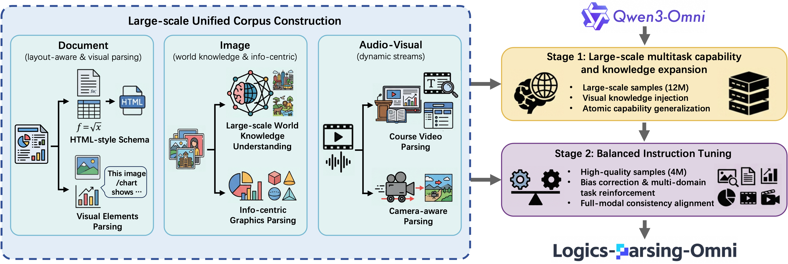

<div align="center">
  
</div>


<p align="center">
    🤗 <a href="https://huggingface.co/Logics-MLLM/Logics-Parsing-Omni">Model</a>&nbsp&nbsp | &nbsp&nbsp📑 <a href="https://arxiv.org/">Technical Report</a>
</p>

## News
* [2026/03/08]: We have released the [**Logics-Parsing-Omni**](https://huggingface.co/Logics-MLLM/Logics-Parsing-Omni). For more details, please check our [**Logics-Parsing-Omni paper**](https://arxiv.org/).
* [2026/02/13] 🚀🚀🚀🚀🚀 We release **Logics-Parsing-v2** Model.
* [2025/09/25] 🚀🚀🚀 We have released the [**Logics-Parsing**](https://github.com/alibaba/Logics-Parsing/Logics-Parsing/README.md). For more details, please check our [**Logics-Parsing paper**](https://arxiv.org/abs/2509.19760).


## Introduction
Logics-Parsing-Omni is a unified Multimodal Large Language Model (MLLM) designed to bridge the gap between pixel-level structural parsing and semantic-level cognitive captioning. It delivers breakthroughs in fine-grained perception and high-level cognition across documents, images, audio, and video.

<div align="center">
  
</div>


## Key Features

*   **Omni-Modal Unified Parsing Framework**
    *   It introduces a **progressive three-level paradigm**—integrating Holistic Detection, Fine-grained Recognition, and Semantic Interpretation—that fundamentally bridges the gap between pixel-based perception and logic-based cognition.
    *   It transforms unstructured multimodal signals into a standardized, machine-readable schema that is inherently **Locatable, Enumerable, and Traceable**, forming an indispensable part of fact-based reasoning chains.

*   **Knowledge-Intensive Document & Graphic Interpretation**
    *   Surpassing traditional OCR and generic LLM pipelines, it jointly parses structural elements (e.g., dense text, layout, tables, formulas) and deep semantics (e.g., complex illustrations) with high layout fidelity.
    *   It overcomes the bottleneck of generic image understanding by explicitly extracting dense, attribute-rich underlying data series, axis labels, and spatial topologies from scientific charts and technical diagrams to support reasoning.

*   **Long-Form Audio-Visual & Educational Content Parsing**
    *   Moving beyond flat ASR linear transcripts and generic video summaries, it dynamically synchronizes audio cues with critical visual contexts, explicitly capturing missed details like slides, whiteboards, and code.
    *   It is specifically optimized for long-form educational videos, successfully extracting structured pedagogical organizations (e.g., chapter hierarchies, key concepts) and dynamic narrative logic while mitigating information redundancy and topic drift.

*   **Data-Centric Optimization & Comprehensive Benchmarking**
    *   Powered by a meticulously constructed omni-modal dataset, the **Logics-Parsing-Omni** model establishes a robust balance between fine-grained structural fidelity and deep semantic interpretation, directly enabling downstream tasks like robust RAG and intelligent tutoring.
    *   Alongside the model, it introduces **OmniParsingBench**, a standardized evaluation infrastructure designed to quantitatively assess the full spectrum of parsing capabilities across documents, images, audio, and videos.


## Experimental Results

As demonstrated by the evaluation results on the LogicsParsingBench and OmniDocBench-v1.5 benchmarks, our proposed Logics-Parsing-Omni achieves overall performance superior to most existing general and specialized document parsing models. It shows notable advantages in multilingual document parsing, particularly for Chinese content, while maintaining balanced and robust capabilities across various structural elements such as text, tables, and formulas. These results validate the effectiveness and generality of the proposed unified single-stage architecture and training strategy for multimodal and diverse document parsing tasks.

## Quick Start

### 1. Installation
```shell
conda create -n logics-parsing-omni python=3.10
conda activate logics-parsing-omni

pip install -r requirements.txt
```


### 2. Inference

We provide a unified multimodal inference script (`inference.py`) that supports **12 pre-defined tasks** across 4 different modalities (Single Image, Multi-Image, Audio, and Video). 

You can easily test different capabilities using the `--task` argument. Additionally, all pre-defined tasks support bilingual prompts. You can switch between English and Chinese using the `--language` argument (`en` or `ch`, defaults to `en`).

#### Option A: Run a Pre-defined Task
Test a specific capability using built-in prompts and assets by passing the corresponding task name and your preferred language:

```shell
# Example: Run the natural video parsing task with the English prompt (default)
python inference.py --task natural_video_parsing --language en

# Example: Run the document structure parsing task with the Chinese prompt
python inference.py --task document_structure_parsing --language ch
```

#### Option B: Run a Custom Task (CLI Mode)
If you want to test your own files and prompts, use the `--task custom` mode along with the specific modality argument. *(Note: The `--language` argument is ignored in custom mode since you provide the prompt directly).*

```shell
# Example 1: Single Image Inference
python inference.py --task custom \
    --image_paths path/to/image.jpg \
    --text_prompt "Describe the content of this image."

# Example 2: Multi-Image Inference
python inference.py --task custom \
    --image_paths path/to/image1.jpg path/to/image2.jpg \
    --text_prompt "What are the differences between these two images?"

# Example 3: Single Audio Inference
python inference.py --task custom \
    --audio_path path/to/audio.wav \
    --text_prompt "Please transcribe this audio."

# Example 4: Single Video Inference (with audio extraction)
python inference.py --task custom \
    --video_path path/to/video.mp4 \
    --use_audio_in_video \
    --text_prompt "Please summarize this video."
```

### 3. Supported Pre-defined Tasks

Here is the complete list of built-in tasks you can pass to the `--task` argument, along with their corresponding English and Chinese prompts:

| Modality | Task Argument (`--task`) | English Prompt (`--language en`) | Chinese Prompt (`--language ch`) |
| :--- | :--- | :--- | :--- |
| **Single Image** | `document_structure_parsing` | Output the parsing results of this document in JSON format. | 请以JSON格式输出该文档的结构化解析结果。 |
| | `document_structure_and_semantic_parsing`| Output the parsing results of this document in JSON format. Include descriptions for illustrations, structurally parse natural images and graphics, and add a global overview at the end. Use the same language as the document text. | 请以JSON格式输出该文档的解析结果。包含对插图的描述，对自然图像和图形进行结构化解析，并在最后添加全局概述。请使用与文档文本相同的语言。 |
| | `natural_image_parsing` | Please detect text and entities in the image, extract structured information such as bounding boxes, labels, attributes, and detailed descriptions, and provide a global image description. Output the results in JSON format. | 请检测图中的文本与实体，提取边界框、标签、属性及详细描述等结构化信息，并给出全局图像描述。结果以JSON格式输出。 |
| | `chart_image_parsing` | Perform an in-depth parsing of the image, locate text and charts, extract their bounding boxes, labels, parsing results, and descriptions, and provide a global image description. Please present the results in JSON format. | 对图片进行深度解析，定位文本和图表，提取其边界框、标签、解析结果与描述，并给出全局图像描述，请用JSON格式呈现。 |
| | `geometric_image_parsing` | Please detect the text and geometric shapes in the image, extract bounding boxes, labels, parsing results, and detailed descriptions, and provide a global image description. Output the results in JSON format. | 请检测图中的文本和几何形状，提取边界框、标签、解析结果及详细描述，并提供全局图像描述。结果以JSON格式输出。 |
| **Audio** | `audio_parsing` | Divide the audio into continuous segments primarily based on speaker and VAD (split non-speech parts by audio classification); segments should include timestamps, classification labels, ASR, and speaker IDs, with a global description added at the end, output in JSON format. | 主要基于说话人和VAD将音频划分为连续的片段（通过音频分类分割非语音部分）；片段应包含时间戳、分类标签、ASR和说话人ID，最后添加全局描述，以JSON格式输出。 |
| **Video** | `natural_video_parsing` | Split the video into continuous time segments based on visual semantic changes; for each segment, extract timestamps, internal audio split points and classification labels (following the principle of prioritizing human voice VAD, and classifying non-vocal parts by audio type) and video attributes. Finally, integrate a global audio-visual description, ASR (including speaker distinction), and language information. Please output in JSON format. | 基于视觉语义变化将视频划分为连续的时间片段；为每个片段提取时间戳、内部音频分割点和分类标签（遵循优先识别人声VAD的原则，并按音频类型对非人声部分进行分类）以及视频属性。最后，整合全局视听描述、ASR（包括说话人区分）和语言信息。请以JSON格式输出。 |
| | `camera_aware_video_parsing` | Describe the video content and its camera movement characteristics, while extracting the timestamps and camera movement labels for the visual segments, outputting in JSON format. | 描述视频内容并说明其运镜特点，同时提取视觉片段的时间戳与运镜标签，以JSON格式输出。 |
| | `text_rich_video_parsing` | Please analyze the video using OCR information stability as the basis for segmentation, extract the timestamp, OCR, and ASR content of each segment in chronological order, add a global audio-video description at the end, and output the result in JSON format. | 请以OCR信息的稳定性作为分割依据对视频进行分析，按时间顺序提取每个片段的时间戳、OCR和ASR内容，在最后添加全局音视频描述，并以JSON格式输出结果。 |
| | `text_rich_video_in_depth_caption` | Based on the input course video, generate a course description report that is clearly structured, detailed in content, and easy for learners to read. | 根据输入的课程视频，生成一份结构清晰、内容详尽、易于学习者阅读的课程描述报告。 |
| **Multi-Image** | `natural_image_diff_parsing` | Generate the structured parsing result of the editing from the first image to the second. List all changed elements item by item, providing their corresponding bounding boxes, labels, attributes, and descriptions; finally, provide a global editing description summarizing the overall changes. Output in JSON format. | 生成从第一张图编辑到第二张图的结构化解析结果。逐项列出所有变化元素，并给出对应的边界框、标签、属性及描述等信息；最后给出全局编辑描述总结整体变化。以JSON格式输出。 |
| | `geometric_diff_parsing` | Generate the geometric editing parsing result from the first image to the second. The content must include a structured parsing of all changed geometric elements, their geometric and quantitative relationships, and provide a global editing instruction summarizing the overall changes. Output in JSON format. | 生成从第一张图到第二张图的几何编辑解析结果。内容需包含所有变化几何元素的结构化解析、几何与定量关系，并给出总结整体变化的全局编辑指令。以JSON格式输出。 |
## Acknowledgments


We would like to acknowledge the following open-source projects that provided inspiration and reference for this work:
- [Qwen3-Omni](https://github.com/QwenLM/Qwen3-Omni)


