<table align="center" width="100%">
  <tr>
    <td width="10000" align="center">
      <a href="imgs/logo.png"></a>
      <br><br>
      💻 <a href="https://logics.alibaba-inc.com/parsing/">HomePage</a> &nbsp; | &nbsp; 🤗 <a href="https://huggingface.co/Logics-MLLM/Logics-Parsing-V3/tree/main">Model</a> &nbsp; | &nbsp; 🤖 <a href="https://www.modelscope.cn/studios/Alibaba-DT/Logics-Parsing">Demo</a>
    </td>
  </tr>
</table>

Logics-Parsing-V3 is a **0.8B vision-language model** that extends Logics-Parsing-v2 from page-level recognition to structured long-document parsing. It combines **global structural understanding, fine-grained local parsing, and scalability to very long documents**. By carrying a compact structural state across pages, it preserves document context while focusing on local content, incrementally reconstructing a coherent document tree beyond a single context window. It also retains support for complex layouts and specialized content, including scientific formulas and chemical notation.

<table align="center" width="100%">
  <tr>
    <td width="10000" align="center">
      <a href="imgs/overview.png">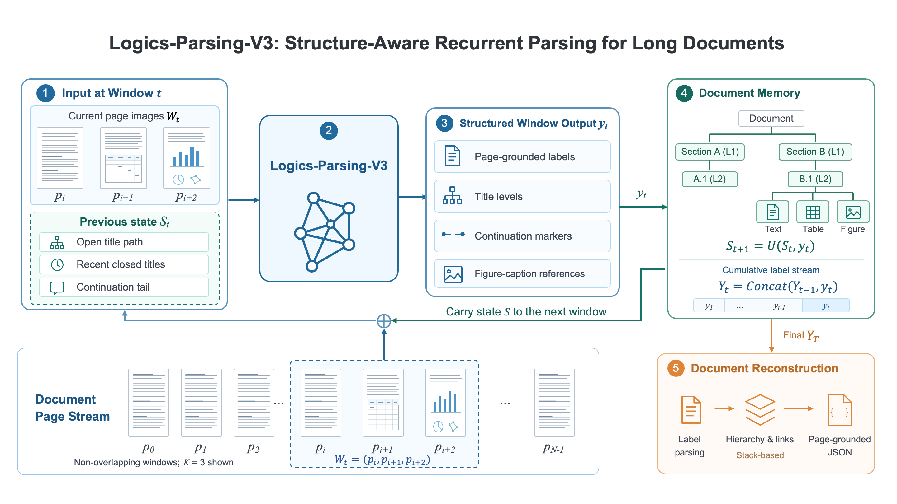</a>
    </td>
  </tr>
</table>

## Benchmark Results

The charts below summarize overall performance and the metric profile on MPDocBench. See [Evaluation](#evaluation) for the full results and document-length analysis.

<table align="center" width="100%">
  <tr>
    <td width="6500" align="center" valign="middle">
      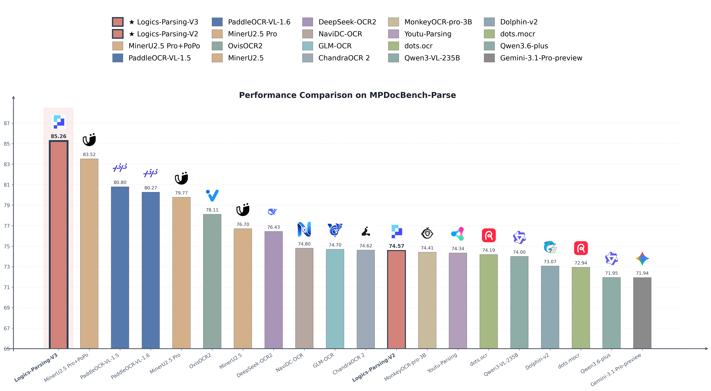
    </td>
    <td width="3500" align="center" valign="middle">
      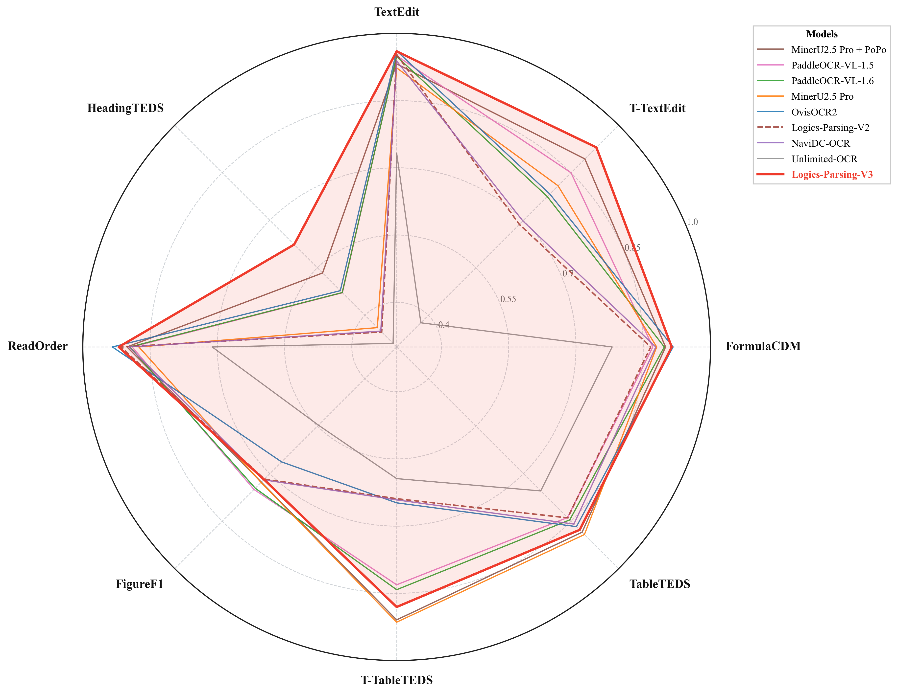
    </td>
  </tr>
</table>

## News

- **2026/09/22:** 🚀 Released Logics-Parsing-V3.
- **2026/03/09:** Released [Logics-Parsing-Omni](https://github.com/alibaba/Logics-Parsing/tree/main/Logics-Parsing-Omni). See the [technical report](https://arxiv.org/pdf/2603.09677) for details.
- **2026/02/13:** Released Logics-Parsing-v2.
- **2025/09/25:** Released Logics-Parsing.

## Key Features

### 1. State-Recurrent Document Modeling

Propagates an evolving structural state across pages, preserving document context in compact memory rather than requiring the full document in a single context window. This recurrent formulation enables incremental structure recovery as document length grows.

### 2. Hierarchical Document Parsing

Unifies global structural reasoning with fine-grained local recognition to recover a coherent document hierarchy. Reconstructs heading levels, merges cross-page elements, and links visual content with related text—all within a single end-to-end model.

<table align="center">
  <thead>
    <tr><th>Model</th><th>Document-Level Joint Parsing</th><th>Cross-Page Element Merging</th><th>Visual–Text Association</th><th>Hierarchy Recovery</th></tr>
  </thead>
  <tbody>
    <tr><td>MinerU2.5-Pro</td><td align="center">✗</td><td align="center">✓</td><td align="center">✗</td><td align="center">✗</td></tr>
    <tr><td>MinerU2.5-Pro + MinerU-PoPo</td><td align="center">✗</td><td align="center">✓</td><td align="center">✓</td><td align="center">✓</td></tr>
    <tr><td>Unlimited-OCR</td><td align="center">✓</td><td align="center">✗</td><td align="center">✗</td><td align="center">✗</td></tr>
    <tr><td><strong>Logics-Parsing-V3</strong></td><td align="center"><strong>✓</strong></td><td align="center"><strong>✓</strong></td><td align="center"><strong>✓</strong></td><td align="center"><strong>✓</strong></td></tr>
  </tbody>
</table>

### 3. Leading Performance

With just **0.8B parameters**, Logics-Parsing-V3 combines leading multi-page parsing performance on MPDocBench with highly competitive single-page results on OmniDocBench v1.6, while demonstrating strong robustness to increasing document length on MPDocBench-Long.

## Evaluation

### Multi-Page Parsing: MPDocBench

On MPDocBench (MPDocBench-Parse), Logics-Parsing-V3 achieves the highest Overall score among the compared models, with leading results on Truncated Text Edit and Heading TEDS. These results highlight its strengths in cross-page text continuity and heading hierarchy recovery.

<table align="center" width="100%">
  <tr>
    <td width="10000" align="center">
      <a href="imgs/mpdocbench_results.png">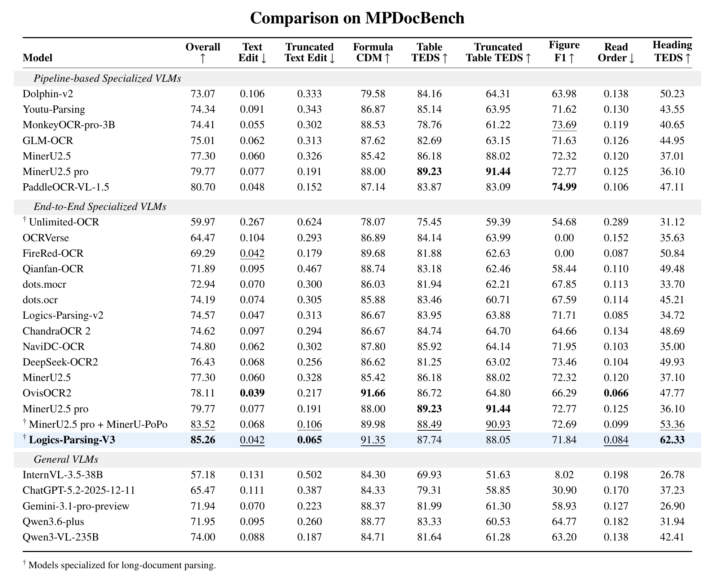</a>
    </td>
  </tr>
</table>

### Single-Page Parsing: OmniDocBench v1.6

In addition to directly parsing multi-page documents, Logics-Parsing-V3 also handles single-page documents effectively, achieving competitive results across text, formulas, tables, and reading order on OmniDocBench v1.6.

<table align="center" width="100%">
  <tr>
    <td width="10000" align="center">
      <a href="imgs/omnidocbench_results.png">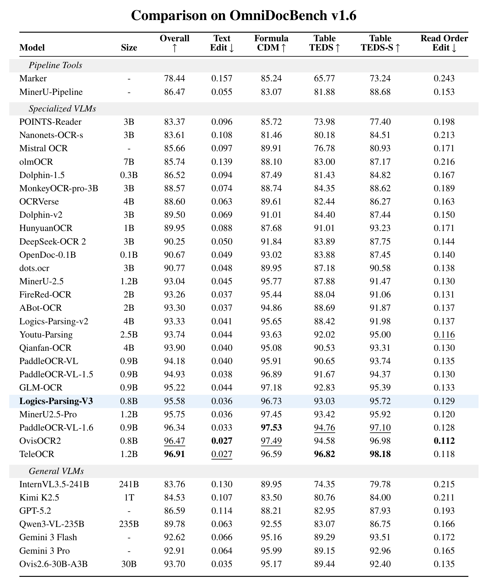</a>
    </td>
  </tr>
</table>

### Length Scaling: MPDocBench-Long

To examine longer inputs beyond the predominantly short documents in MPDocBench, we construct **MPDocBench-Long** by concatenating complete source documents with similar types and resolutions. The benchmark spans five length ranges up to 50 pages, with 50 sequences per range.

Under the **1M inference setting**, Logics-Parsing-V3 maintains more consistent parsing quality as document length increases, while Unlimited-OCR shows a larger decline.

<table align="center" width="100%">
  <tr>
    <td width="10000" align="center">
      <a href="imgs/mpdocbench_long.png">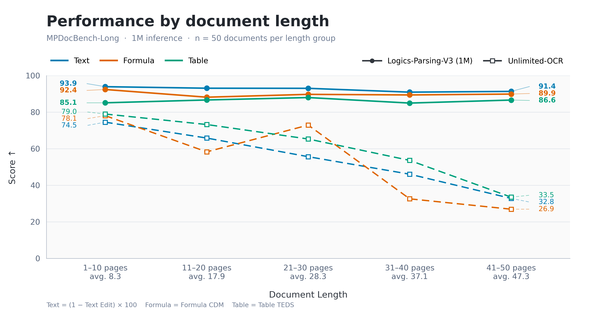</a>
    </td>
  </tr>
</table>

### Inference Efficiency

With only **0.8B parameters**, Logics-Parsing-V3 combines efficient local parsing with document-level context modeling. It processes pages sequentially using **non-overlapping sliding windows**, with each window incorporating the current page content and a **compact structural state** carried forward from the preceding window. This recurrent design preserves cross-page context without repeatedly processing the full document history.

We benchmark inference efficiency on **MPDocBench (420 documents, 3,135 pages)** using **NVIDIA H100 GPUs**, with **batch size 1** for all models.

<table align="center">
  <thead>
    <tr><th>Model</th><th>Total Time (min) ↓</th><th>Time per Page (s) ↓</th></tr>
  </thead>
  <tbody>
    <tr><td>OvisOCR2</td><td align="right">73.26</td><td align="right">1.40</td></tr>
    <tr><td>Unlimited-OCR</td><td align="right">90.12</td><td align="right">1.72</td></tr>
    <tr><td>MinerU2.5-Pro</td><td align="right">175.10</td><td align="right">3.35</td></tr>
    <tr><td>MinerU2.5-Pro + MinerU-PoPo</td><td align="right">197.49</td><td align="right">3.78</td></tr>
    <tr><td>Logics-Parsing-V3</td><td align="right"><strong>72.46</strong></td><td align="right"><strong>1.39</strong></td></tr>
  </tbody>
</table>
*Note: Logics-Parsing-V3 was evaluated with a window size of 3.*

## Quick Start

### 1. Installation

```bash
conda create -n logics-parsing-v3 python=3.10 -y
conda activate logics-parsing-v3

python -m pip install --upgrade pip
python -m pip install "vllm==0.22.1" "transformers==5.6.0" Pillow PyMuPDF
python -m pip check
```

### 2. Download Model Weights

Download Logics-Parsing-V3 from [Hugging Face](https://huggingface.co/Logics-MLLM/Logics-Parsing-V3/tree/main) (default) or [ModelScope](https://www.modelscope.cn/models/Alibaba-DT/Logics-Parsing-V3). Install only the download provider you choose.

```bash
# Hugging Face
python -m pip install -U huggingface_hub
python download_model.py --source hf

# ModelScope (alternative)
python -m pip install -U modelscope
python download_model.py --source modelscope
```

### 3. Inference

`inference_v3.py` supports images, PDFs, and directories of page images. Multi-page inputs use `--window_size 2` by default; single-page inputs always use 1.

**Single-page image**

```bash
python inference_v3.py \
  --model_path ./weights/Logics-Parsing-V3 \
  --input_path /path/to/page.png \
  --output_dir ./outputs/single_page
```

**Multi-page PDF**

```bash
python inference_v3.py \
  --model_path ./weights/Logics-Parsing-V3 \
  --input_path /path/to/document.pdf \
  --output_dir ./outputs/document
```

Outputs in `--output_dir` include parsed content (`markdown.md`), a multi-page document outline (`hierarchy.md`), raw labels (`raw_output.dsl`), and parsing results with metadata (`result.json`).

## Showcases

### Long-Document Parsing

#### Hierarchical Structure

<table align="center" width="100%">
  <tr>
    <td width="10000" align="center">
      <a href="imgs/showcase_hierarchy.png">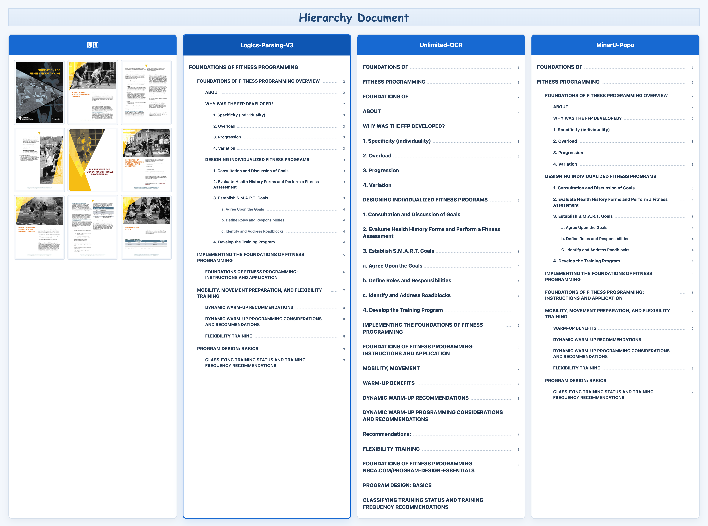</a>
    </td>
  </tr>
</table>

<table align="center" width="100%">
  <tr>
    <td width="10000" align="center">
      <a href="imgs/showcase_hierarchy_comparison.png">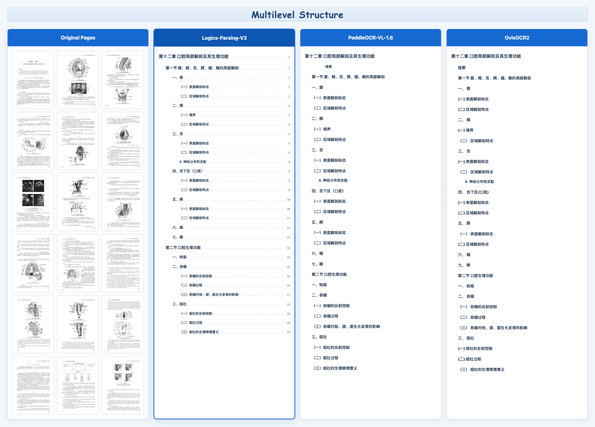</a>
    </td>
  </tr>
</table>

#### Cross-Page Tables

<table align="center" width="100%">
  <tr>
    <td width="10000" align="center">
      <a href="imgs/showcase_cross_page_table_1.png">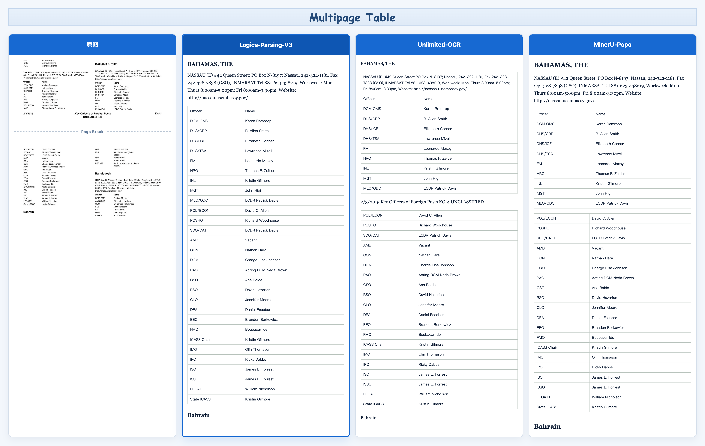</a>
    </td>
  </tr>
</table>

<table align="center" width="100%">
  <tr>
    <td width="10000" align="center">
      <a href="imgs/showcase_cross_page_table_2.png"></a>
    </td>
  </tr>
</table>

#### Cross-Page Text Continuity

<table align="center" width="100%">
  <tr>
    <td width="10000" align="center">
      <a href="imgs/showcase_cross_page_text_paper.png">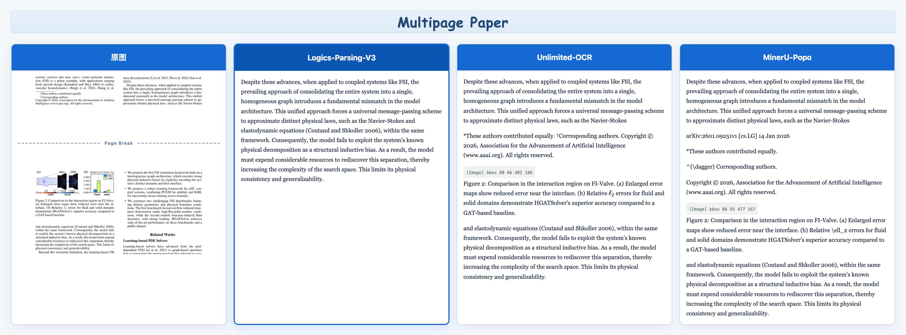</a>
    </td>
  </tr>
</table>

<table align="center" width="100%">
  <tr>
    <td width="10000" align="center">
      <a href="imgs/showcase_cross_page_text_book.png"></a>
    </td>
  </tr>
</table>

### Single-Page Parsing

#### Academic Posters: Reading Order

<table align="center" width="100%">
  <tr>
    <td width="10000" align="center">
      <a href="imgs/showcase_academic_poster.png">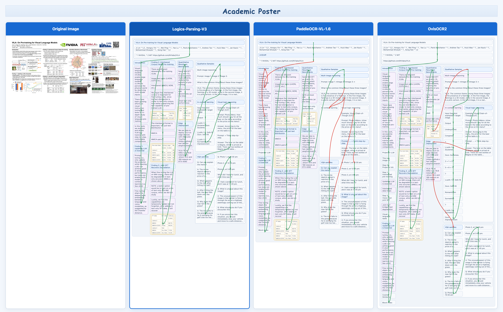</a>
    </td>
  </tr>
</table>

#### Complex Tables

<table align="center" width="100%">
  <tr>
    <td width="10000" align="center">
      <a href="imgs/showcase_complex_table.png">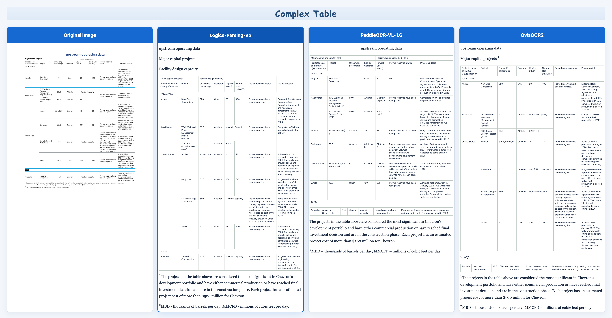</a>
    </td>
  </tr>
</table>

#### Code Blocks

<table align="center" width="100%">
  <tr>
    <td width="10000" align="center">
      <a href="imgs/showcase_code.png">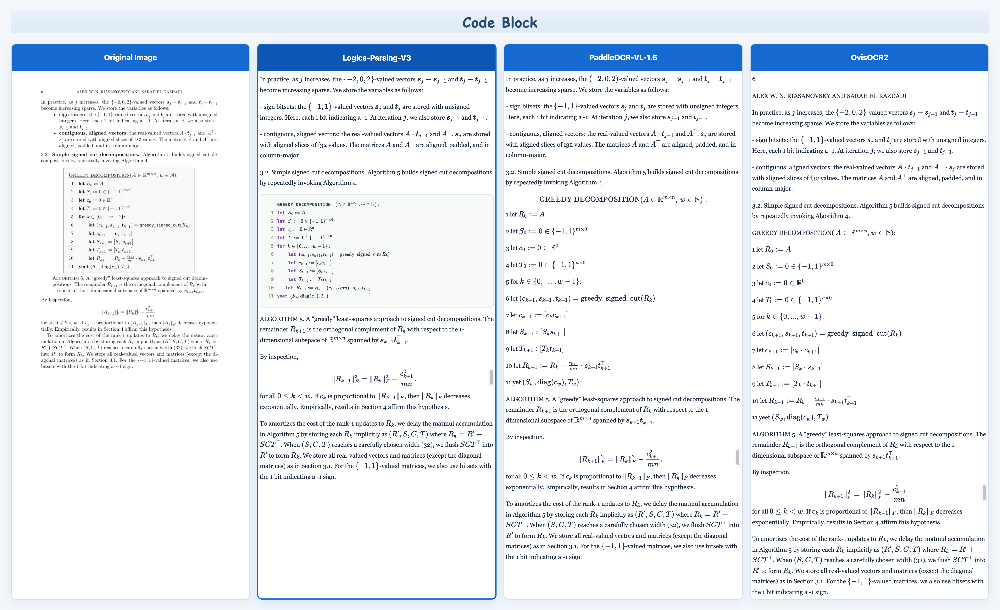</a>
    </td>
  </tr>
</table>

#### Chemistry Exam Papers

<table align="center" width="100%">
  <tr>
    <td width="10000" align="center">
      <a href="imgs/showcase_chemistry.png">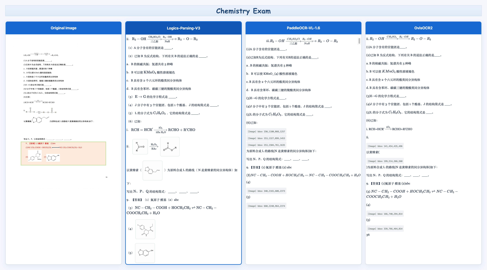</a>
    </td>
  </tr>
</table>

#### Handwritten Notes

<table align="center" width="100%">
  <tr>
    <td width="10000" align="center">
      <a href="imgs/showcase_handwriting.png">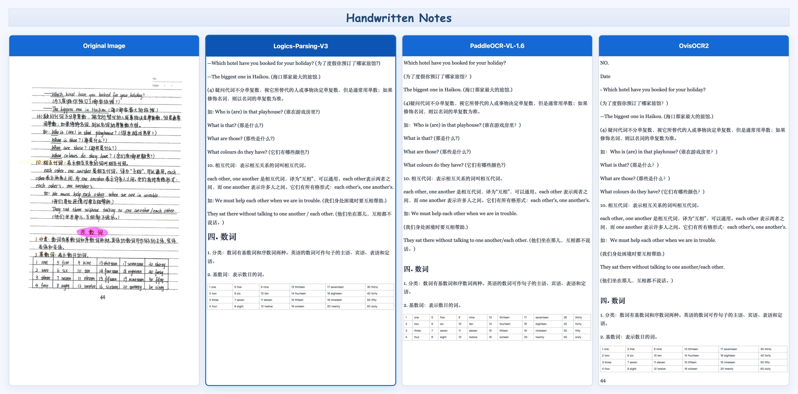</a>
    </td>
  </tr>
</table>
