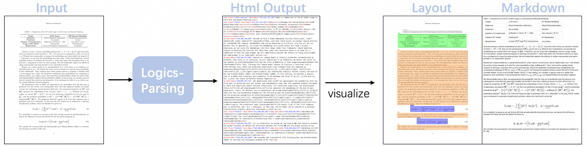

<div align="center">
  
</div>


<p align="center">
    💻 <a href="https://logics.alibaba-inc.com/parsing/?spm=label.2ef5001f.0.0.1c702159dQbTRd">HomePage</a>&nbsp&nbsp | &nbsp&nbsp🤗 <a href="https://huggingface.co/Logics-MLLM/Logics-Parsing-v2">Model</a>&nbsp&nbsp | &nbsp&nbsp🤖 <a href="https://www.modelscope.cn/studios/Alibaba-DT/logix/summary">Demo</a>
</p>


<div align="center">
  
</div>

<div align="center">
  
</div>


## Updates
* [2026/02/13] 🚀🚀🚀🚀🚀 We release Logics-Parsing-v2 Model.
* [2025/09/25] 🚀🚀🚀We release Logics-Parsing Model.

## Introduction

**Logics-Parsing-v2** is an advanced evolution of the previously proposed Logics-Parsing (v1). It inherits all the core capabilities of v1 model, while demonstrating more powerful capabilities on handling complex documents. Furthermore, it extends support for **Parsing-2.0** scenarios, enabling structured parsing of musical sheets, flowcharts, as well as code/pseudocode blocks.

<div align="center">
  
</div>

<!-- <div align="center">
  <table style="width: 800px;">
    <tr>
      <td align="center">
        
      </td>
      <td align="center">
        
      </td>
      <td align="center">
        
      </td>
      <td align="center">
        
      </td>
    </tr>
    <tr>
      <td align="center"><b>report</b></td>
      <td align="center"><b>chemistry</b></td>
      <td align="center"><b>paper</b></td>
      <td align="center"><b>handwritten</b></td>
    </tr>
  </table>
</div>
 -->

## Key Features
<details>
    <summary><strong>v1</strong></summary>
*   **Effortless End-to-End Processing**

*   Our single-model architecture eliminates the need for complex, multi-stage pipelines. Deployment and inference are straightforward, going directly from a document image to structured output.
*   It demonstrates exceptional performance on documents with challenging layouts.

*   **Advanced Content Recognition**

    *   It accurately recognizes and structures difficult content, including intricate scientific formulas.
    *   Chemical structures are intelligently identified and can be represented in the standard **SMILES** format.

*   **Rich, Structured HTML Output**

    *   The model generates a clean HTML representation of the document, preserving its logical structure.
    *   Each content block (e.g., paragraph, table, figure, formula) is tagged with its **category**, **bounding box coordinates**, and **OCR text**.
    *   It automatically identifies and filters out irrelevant elements like headers and footers, focusing only on the core content.

*   **State-of-the-Art Performance**

    * Logics-Parsing achieves the best performance on our in-house benchmark, which is specifically designed to comprehensively evaluate a model’s parsing capability on complex-layout documents and STEM content.
</details>


### v2
*   **Effortless End-to-End Processing**

    *   End-to-end recognition and parsing for various kinds of document elements within a single model.
    *   Handles complex-layout and text-dense documents such as newspapers and magazines with exceptional precision and ease;

*   **Advanced Content Recognition**

    *   Smaller in size, greater in performance, delivering more accurate and structured parsing of tables and scientific formulas.
    *   Introducing **Parsing-2.0**: natively supports parsing of diverse structured content, including flowcharts, music sheets and pseudocode blocks.

*   **Rich, Structured HTML Output**

    *   Transforms documents into concise HTML -- capturing not just content, but also element types, spatial layouts, and semantic hierarchy.
    *   More scientific and intuitive formats for structured elements -- such as Mermaid for flowcharts and ABC notation for musical scores.

*   **State-of-the-Art Performance**

    *   SOTA across the board: Logics-Parsing-v2 sets top records on both our in-house benchmark (overall score: **82.16**) and the renowned public benchmark OmniDocBench-v1.5 (overall score: **93.23**). 


## Benchmark
<details>
    <summary><strong>v1</strong></summary>
    Existing document-parsing benchmarks often provide limited coverage of complex layouts and STEM content. To address this, we constructed an in-house benchmark comprising 1,078 page-level images across nine major categories and over twenty sub-categories. Our model achieves the best performance on this benchmark.
    <div align="center">
      
    </div>
    <table>
        <tr>
            <td rowspan="2">Model Type</td>
            <td rowspan="2">Methods</td>
            <td colspan="2">Overall <sup>Edit</sup> ↓</td>
            <td colspan="2">Text Edit <sup>Edit</sup> ↓</td>
            <td colspan="2">Formula <sup>Edit</sup> ↓</td>
            <td colspan="2">Table <sup>TEDS</sup> ↑</td>
            <td colspan="2">Table <sup>Edit</sup> ↓</td>
            <td colspan="2">ReadOrder<sup>Edit</sup> ↓</td>
            <td rowspan="1">Chemistry<sup>Edit</sup> ↓</td>
            <td rowspan="1">HandWriting<sup>Edit</sup> ↓</td>
        </tr>
        <tr>
            <td>EN</td>
            <td>ZH</td>
            <td>EN</td>
            <td>ZH</td>
            <td>EN</td>
            <td>ZH</td>
            <td>EN</td>
            <td>ZH</td>
            <td>EN</td>
            <td>ZH</td>
            <td>EN</td>
            <td>ZH</td>
            <td>ALL</td>
            <td>ALL</td>
        </tr>
        <tr>
            <td rowspan="7">Pipeline Tools</td>
            <td>doc2x</td>
            <td>0.209</td>
            <td>0.188</td>
            <td>0.128</td>
            <td>0.194</td>
            <td>0.377</td>
            <td>0.321</td>
            <td>81.1</td>
            <td>85.3</td>
            <td><ins>0.148</ins></td>
            <td><ins>0.115</ins></td>
            <td>0.146</td>
            <td>0.122</td>
            <td>1.0</td>
            <td>0.307</td>
        </tr>
        <tr>
            <td>Textin</td>
            <td>0.153</td>
            <td>0.158</td>
            <td>0.132</td>
            <td>0.190</td>
            <td>0.185</td>
            <td>0.223</td>
            <td>76.7</td>
            <td><ins>86.3</ins></td>
            <td>0.176</td>
            <td><b>0.113</b></td>
            <td><b>0.118</b></td>
            <td><b>0.104</b></td>
            <td>1.0</td>
            <td>0.344</td>
        </tr>
        <tr>
            <td>mathpix<sup>*</sup></td>
            <td><ins>0.128</ins></td>
            <td><ins>0.146</ins></td>
            <td>0.128</td>
            <td><ins>0.152</ins></td>
            <td><b>0.06</b></td>
            <td><b>0.142</b></td>
            <td><b>86.2</b></td>
            <td><b>86.6</b></td>
            <td><b>0.120</b></td>
            <td>0.127</td>
            <td>0.204</td>
            <td>0.164</td>
            <td>0.552</td>
            <td>0.263</td>
        </tr>
        <tr>
            <td>PP_StructureV3</td>
            <td>0.220</td>
            <td>0.226</td>
            <td>0.172</td>
            <td>0.29</td>
            <td>0.272</td>
            <td>0.276</td>
            <td>66</td>
            <td>71.5</td>
            <td>0.237</td>
            <td>0.193</td>
            <td>0.201</td>
            <td>0.143</td>
            <td>1.0</td>
            <td>0.382</td>
        </tr>
        <tr>
            <td>Mineru2</td>
            <td>0.212</td>
            <td>0.245</td>
            <td>0.134</td>
            <td>0.195</td>
            <td>0.280</td>
            <td>0.407</td>
            <td>67.5</td>
            <td>71.8</td>
            <td>0.228</td>
            <td>0.203</td>
            <td>0.205</td>
            <td>0.177</td>
            <td>1.0</td>
            <td>0.387</td>
        </tr>
        <tr>
            <td>Marker</td>
            <td>0.324</td>
            <td>0.409</td>
            <td>0.188</td>
            <td>0.289</td>
            <td>0.285</td>
            <td>0.383</td>
            <td>65.5</td>
            <td>50.4</td>
            <td>0.593</td>
            <td>0.702</td>
            <td>0.23</td>
            <td>0.262</td>
            <td>1.0</td>
            <td>0.50</td>
        </tr>
        <tr>
            <td>Pix2text</td>
            <td>0.447</td>
            <td>0.547</td>
            <td>0.485</td>
            <td>0.577</td>
            <td>0.312</td>
            <td>0.465</td>
            <td>64.7</td>
            <td>63.0</td>
            <td>0.566</td>
            <td>0.613</td>
            <td>0.424</td>
            <td>0.534</td>
            <td>1.0</td>
            <td>0.95</td>
        </tr>
        <tr>
            <td rowspan="8">Expert VLMs</td>
            <td>Dolphin</td>
            <td>0.208</td>
            <td>0.256</td>
            <td>0.149</td>
            <td>0.189</td>
            <td>0.334</td>
            <td>0.346</td>
            <td>72.9</td>
            <td>60.1</td>
            <td>0.192</td>
            <td>0.35</td>
            <td>0.160</td>
            <td>0.139</td>
            <td>0.984</td>
            <td>0.433</td>
        </tr>
        <tr>
            <td>dots.ocr</td>
            <td>0.186</td>
            <td>0.198</td>
            <td><ins>0.115</ins></td>
            <td>0.169</td>
            <td>0.291</td>
            <td>0.358</td>
            <td>79.5</td>
            <td>82.5</td>
            <td>0.172</td>
            <td>0.141</td>
            <td>0.165</td>
            <td>0.123</td>
            <td>1.0</td>
            <td><ins>0.255</ins></td>
        </tr>
        <tr>
            <td>MonkeyOcr</td>
            <td>0.193</td>
            <td>0.259</td>
            <td>0.127</td>
            <td>0.236</td>
            <td>0.262</td>
            <td>0.325</td>
            <td>78.4</td>
            <td>74.7</td>
            <td>0.186</td>
            <td>0.294</td>
            <td>0.197</td>
            <td>0.180</td>
            <td>1.0</td>
            <td>0.623</td>
        </tr>
        <tr>
            <td>OCRFlux</td>
            <td>0.252</td>
            <td>0.254</td>
            <td>0.134</td>
            <td>0.195</td>
            <td>0.326</td>
            <td>0.405</td>
            <td>58.3</td>
            <td>70.2</td>
            <td>0.358</td>
            <td>0.260</td>
            <td>0.191</td>
            <td>0.156</td>
            <td>1.0</td>
            <td>0.284</td>
        </tr>
        <tr>
            <td>Gotocr</td>
            <td>0.247</td>
            <td>0.249</td>
            <td>0.181</td>
            <td>0.213</td>
            <td>0.231</td>
            <td>0.318</td>
            <td>59.5</td>
            <td>74.7</td>
            <td>0.38</td>
            <td>0.299</td>
            <td>0.195</td>
            <td>0.164</td>
            <td>0.969</td>
            <td>0.446</td>
        </tr>
        <tr>
            <td>Olmocr</td>
            <td>0.341</td>
            <td>0.382</td>
            <td>0.125</td>
            <td>0.205</td>
            <td>0.719</td>
            <td>0.766</td>
            <td>57.1</td>
            <td>56.6</td>
            <td>0.327</td>
            <td>0.389</td>
            <td>0.191</td>
            <td>0.169</td>
            <td>1.0</td>
            <td>0.294</td>
        </tr>
        <tr>
            <td>SmolDocling</td>
            <td>0.657</td>
            <td>0.895</td>
            <td>0.486</td>
            <td>0.932</td>
            <td>0.859</td>
            <td>0.972</td>
            <td>18.5</td>
            <td>1.5</td>
            <td>0.86</td>
            <td>0.98</td>
            <td>0.413</td>
            <td>0.695</td>
            <td>1.0</td>
            <td>0.927</td>
        </tr>
        <tr>
            <td><b>Logics-Parsing</b></td>
            <td><b>0.124</b></td>
            <td><b>0.145</b></td>
            <td><b>0.089</b></td>
            <td><b>0.139</b></td>
            <td><ins>0.106</ins></td>
            <td><ins>0.165</ins></td>
            <td>76.6</td>
            <td>79.5</td>
            <td>0.165</td>
            <td>0.166</td>
            <td><ins>0.136</ins></td>
            <td><ins>0.113</ins></td>
            <td><b>0.519</b></td>
            <td><b>0.252</b></td>
        </tr>
        <tr>
            <td rowspan="5">General VLMs</td>
            <td>Qwen2VL-72B</td>
            <td>0.298</td>
            <td>0.342</td>
            <td>0.142</td>
            <td>0.244</td>
            <td>0.431</td>
            <td>0.363</td>
            <td>64.2</td>
            <td>55.5</td>
            <td>0.425</td>
            <td>0.581</td>
            <td>0.193</td>
            <td>0.182</td>
            <td>0.792</td>
            <td>0.359</td>
        </tr>
        <tr>
            <td>Qwen2.5VL-72B</td>
            <td>0.233</td>
            <td>0.263</td>
            <td>0.162</td>
            <td>0.24</td>
            <td>0.251</td>
            <td>0.257</td>
            <td>69.6</td>
            <td>67</td>
            <td>0.313</td>
            <td>0.353</td>
            <td>0.205</td>
            <td>0.204</td>
            <td>0.597</td>
            <td>0.349</td>
        </tr>
        <tr>
            <td>Doubao-1.6</td>
            <td>0.188</td>
            <td>0.248</td>
            <td>0.129</td>
            <td>0.219</td>
            <td>0.273</td>
            <td>0.336</td>
            <td>74.9</td>
            <td>69.7</td>
            <td>0.180</td>
            <td>0.288</td>
            <td>0.171</td>
            <td>0.148</td>
            <td>0.601</td>
            <td>0.317</td>
        </tr>
        <tr>
            <td>GPT-5</td>
            <td>0.242</td>
            <td>0.373</td>
            <td>0.119</td>
            <td>0.36</td>
            <td>0.398</td>
            <td>0.456</td>
            <td>67.9</td>
            <td>55.8</td>
            <td>0.26</td>
            <td>0.397</td>
            <td>0.191</td>
            <td>0.28</td>
            <td>0.88</td>
            <td>0.46</td>
        </tr>
        <tr>
            <td>Gemini2.5 pro</td>
            <td>0.185</td>
            <td>0.20</td>
            <td><ins>0.115</ins></td>
            <td>0.155</td>
            <td>0.288</td>
            <td>0.326</td>
            <td><ins>82.6</ins></td>
            <td>80.3</td>
            <td>0.154</td>
            <td>0.182</td>
            <td>0.181</td>
            <td>0.136</td>
            <td><ins>0.535</ins></td>
            <td>0.26</td>
        </tr>
    </table>
    <!-- 脚注说明 -->
    <tr>
      <td colspan="5">
        <sup>*</sup> Tested on the v3/PDF Conversion API (August 2025 deployment).
      </td>
    </tr>
</details>


### Comparisons on LogicsDocBench

We introduce **LogicsDocBench**, a new comprehensive evaluation benchmark comprising 900 carefully selected PDF pages, covering both traditional document Parsing-1.0 tasks and the newly introduced Parsing-2.0 scenarios. This benchmark is designed to better assess models’ capabilities in complex and diverse real-world documents parsing. The dataset is organized into three core document subsets:

* **STEM Documents (218 pages)**:

    Focuses on high-difficulty academic and educational content, spanning over ten domains including physics, mathematics, engineering, and interdisciplinary sciences. This subset evaluates deep understanding of mathematical formulas, technical terminology, and structured knowledge representation.

* **Complex Layouts (459 pages)**:

    Includes challenging real-world layouts such as multi-column text, cross-page tables, vertical writing, and mixed text-image arrangements. This subset comprehensively evaluate a model’s layout analysis abilities.

* **Parsing-2.0 Content (223 pages)**:

    Targets modern digital and semi-structured content that poses significant challenges for traditional OCR systems, including:
    * Chemical Molecular formulas
    * Musical sheets
    * Code and pseudo-code block
    * Flowcharts and mind maps

For Parsing-1.0 tasks, we adopt the same evaluation protocols as OmniDocBench-v1.5 to ensure fairness and consistency across benchmarks. For Parsing-2.0, we report fine-grained results using edit distance for each subcategory, and compute an overall score as follows:

$$\small \text{Overall} = \frac{Parsing1.0^{Overall} \times 3 + (1-{Chemistry}^{Edit})\times 100 + (1-{Code}^{Edit})\times 100 + (1-{Chart}^{Edit})\times 100 + (1-{Music}^{Edit})\times 100}{7}$$

Comprehensive evaluation of document parsing on LogicsDocBench is listed as follows:

<div align="center">
  
</div>

The histogram below provides a more intuitive visualization of the advantages of our Logics-Parsing-v2 model in both Parsing-1.0 and 2.0 scenarios.

<div align="center">
  
</div>


### Comparisons on OmniDocBench_v1.5

We also provide the experimental results of our newly proposed Logics-Parsing-v2 model on the widely recognized open-source benchmark OmniDocBench-v1.5. As shown in the table below, Logics-Parsing-v2 achieves the highest scores among all other approaches, demonstrating its effectiveness and superiority.

<div align="center">
  
</div>

_\* The model results in the table are sourced from the official OmniDocBench website._


## Quick Start

<details>
    <summary><strong>v1</strong></summary>
### 1. Installation
```shell
conda create -n logis-parsing python=3.10
conda activate logis-parsing
pip install -r requirement.txt
```
### 2. Download Model Weights
```
# Download our model from Modelscope.
pip install modelscope
python download_model.py -t modelscope
# Download our model from huggingface.
pip install huggingface_hub
python download_model.py -t huggingface
```
### 3. Inference
```shell
python3 inference.py --image_path PATH_TO_INPUT_IMG --output_path PATH_TO_OUTPUT --model_path PATH_TO_MODEL
```
</details>

### 1. Installation
```shell
conda create -n logis-parsing-v2 python=3.10
conda activate logis-parsing-v2

pip install -r requirements.txt
```
### 2. Download Model Weights

```
# Download our model from Modelscope.
pip install modelscope
python download_model_v2.py -t modelscope

# Download our model from huggingface.
pip install huggingface_hub
python download_model_v2.py -t huggingface
```

### 3. Inference
```shell
python3 inference_v2.py --image_path PATH_TO_INPUT_IMG --output_path PATH_TO_OUTPUT --model_path PATH_TO_MODEL
```


## Showcases

<div align="center">
  
</div>
<div align="center">
  
</div>
<div align="center">
  
</div>
<div align="center">
  
</div>
<div align="center">
  
</div>
<div align="center">
  
</div>
<div align="center">
  
</div>
<div align="center">
  
</div>


## Acknowledgments


We would like to acknowledge the following open-source projects that provided inspiration and reference for this work:
- [Qwen3-VL](https://github.com/QwenLM/Qwen3-VL)
- [OmniDocBench](https://github.com/opendatalab/OmniDocBench)
- [Mathpix](https://mathpix.com/)

